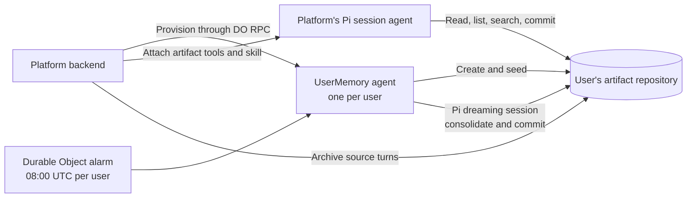

# Agent memory with Cloudflare Artifacts

This combines:

- [Cognition's Agent Memory Repo](https://cognition.com/agent-memory-repo) and the [open file structure spec](https://github.com/AgentMemoryRepo/agentmemoryrepo/blob/main/SPEC.md)
- [Cloudflare Artifacts](https://developers.cloudflare.com/artifacts/)
- [Pi + Pi Durable harness in the Agents SDK](https://developers.cloudflare.com/changelog/post/2026-10-02-pi-harness/)

Each user gets a Git repository for memory. Your platform attaches that artifact
to its existing Pi agent through repository tools and a memory skill. A separate
platform-owned agent consolidates the same repository overnight, using a
Durable Object alarm.



## Integrate with a platform

The reusable exports in `src/index.ts` provide provisioning, artifact tools,
memory skills, and the dreaming agent. Your platform chooses the authenticated
user and artifact; the model receives a capability for that one repository.

Bind `ARTIFACTS`, `AI`, and the `UserMemory` Durable Object in your Worker,
export the `UserMemory` class, and provide `MODEL` and `DREAM_CRON`.
The example's `wrangler.jsonc` shows these bindings and the SQLite migration.

On signup, call the owner directly through Durable Object RPC:

```ts
// In your platform Worker, after authenticating the user:
const userId = authenticatedUser.id;
const owner = env.UserMemory.getByName(userId);
const { repo } = await owner.provision(userId, authenticatedUser.name);
// Retain repo in your user record and attach it to later agent sessions.
```

Provisioning is retryable. It creates a deterministic per-user artifact,
seeds its entry point, and registers the user's persistent dreaming schedule.
IDs contain 1–80 letters, digits, underscores, or hyphens.

Inside your existing PiHarness factory, attach the repository and skill:

```ts
import {
  ArtifactRepository,
  artifactTools,
  memoryContext,
  memoryPolicy,
  memorySkillSource,
} from "./src/index";
import { createRegistry, Harness } from "@earendil-works/pi-durable";
import { skills } from "agents/harness/pi";

// Inside PiHarness's harness({ storage, context }) callback.
// models is your configured Pi model registry.
// repoName and currentSource come from your trusted session state.
const artifact = new ArtifactRepository(env.ARTIFACTS, repoName, memoryPolicy);
const registry = createRegistry();
registry.install(artifactTools(() => artifact));
registry.install(
  memoryContext(
    () => artifact,
    () => `Activate artifact-memory. Current source: ${currentSource}.`,
  ),
);
registry.install(await skills([memorySkillSource]));
return Harness.open(storage, { models, registry }, context);
```

`memoryContext` includes the latest `MEMORY.md` on each model request. The skill
teaches the agent when to retrieve deeper notes, which facts to retain, and how
to format them. `examples/session-agent.ts` shows a complete durable session
using the requested Pi harness, including queued turns and recovery.

The agent works on ordinary repository files:

| Tool              | Operations                                                                                |
| ----------------- | ----------------------------------------------------------------------------------------- |
| `artifact`        | `read` a path, `list` by prefix, literal `search`, or Git `history`                       |
| `artifact_commit` | Commit and push file edits atomically against `expectedHead`; null content deletes a file |

For example, `artifact({ action: "read", path: "preferences.md" })` reads a note.
The same operation reads `sessions/teach/t1.json`; source records use normal
repository paths. Listing with `prefix: "sessions/"` finds archived evidence.

The tools have no user selector or credential parameter. `memoryPolicy` keeps
`MEMORY.md` present and makes `sessions/` and `.platform/` read-only to the
agent. The generic repository adapter accepts other policies and file layouts.

## Record evidence

Your platform writes the actual user input before calling the model and the
answer afterward. This gives the dreamer evidence beyond the facts an agent
chose to save:

```ts
import { ArtifactRepository, archiveSource } from "./src/index";

// This unrestricted capability stays in platform code.
const artifact = new ArtifactRepository(env.ARTIFACTS, repoName);
const path = `sessions/${sessionId}/${turnId}.json`;
await archiveSource(artifact, path, {
  role: "user",
  text: userMessage,
  receivedAt: new Date().toISOString(),
});
// Supply artifact://sessions/SESSION/TURN.json as currentSource to the agent.
```

A source path is immutable: retrying the same content succeeds, while reusing
the path with different content fails. Use stable timestamps and turn IDs on
retries. `archiveSource` reconciles concurrent commits without overwriting
curated memory.

## Memory format

Provisioning seeds three files without fictitious user facts:

```text
memory-<user hash>/
  MEMORY.md
  preferences.md
  projects/README.md
```

The entry point stays brief, with essential facts at the top and links under
`## Index`:

```md
# Memory: Alice

## Index

- [[preferences]]
- [[projects/README]]
```

The memory skill uses the Cognition format: single-line facts with provenance
and root-relative links, omitting `.md` in Markdown links:

```md
- Alice prefers concise summaries [source: artifact://sessions/teach/t1.json; added: 2026-10-06]
- Priya owns pricing for [[projects/payments]] [source: artifact://sessions/teach/t1.json]
```

Other files can hold reusable SQL, scripts, and project context. They are
reference material; the artifact tool does not execute them.

Reads use the Artifacts binding. Writes mint a five-minute repository token,
clone `main` into an ephemeral `memfs` checkout with `isomorphic-git`, commit,
push, and revoke the token. Artifacts holds the durable files and Git history.

Expected-head checks and Git's non-force push protect concurrent sessions and
dreaming. A conflicting commit returns the latest head so the agent can reread
and reconcile. Multi-file commits keep a note and its index together. After an
interrupted write, the skill tells the agent to inspect whether it landed before
retrying.

## Overnight dreaming

Each `UserMemory` agent registers its own alarm-backed schedule:

```ts
await this.schedule(this.env.DREAM_CRON, "dream", undefined, {
  retry: { maxAttempts: 3 },
});
```

The [Agents SDK scheduler](https://developers.cloudflare.com/agents/runtime/execution/schedule-tasks/)
persists the task and wakes the Durable Object with an alarm. The default time
expression is `0 8 * * *`, or 08:00 UTC daily. Change it for your platform's
overnight window. Recurring registration is deduplicated by the SDK.

The scheduler, queue, and Pi recovery share the SDK-managed alarm; the example
leaves alarm ownership with the SDK. There is no Worker Cron Trigger.

Each nightly run opens a fresh Pi session with the same artifact tools plus
`artifact-memory` and `artifact-dreaming`. It reads source turns, finds useful
patterns, reconciles corrections, merges duplicate notes, repairs links, and
commits changes. The platform archives its report under `.platform/dreams/`.
Live sessions can continue writing; conflicts require rereading.

For a demonstration, platform code can call
`owner.requestDream("demo-night")` and inspect `owner.dreamStatus("demo-night")`
through RPC. A run ID identifies the same durable Pi operation on retries.

## Run the example

The deployable sample lives in `examples/`. It adds a session agent and one
protected `POST /demo` runner. The runner provisions a fresh user, teaches a
preference and project facts, retrieves them in a fresh conversation, records a
correction, archives a turn that was never curated by a live agent, triggers
dreaming, and retrieves the consolidated memory afterward. This lets the dreamer
recover a preference that exists only in the archived evidence.
It streams progress as newline-delimited JSON.

```sh
npm ci
npm run types
npm run check
npx wrangler secret put DEMO_API_KEY
npm run deploy

MEMORY_URL=https://artifacts-agent-memory.YOUR-SUBDOMAIN.workers.dev \
DEMO_API_KEY=YOUR-SECRET npm run demo
```

For local Worker development, put `DEMO_API_KEY` in the ignored `.dev.vars`
file and run `npm run dev`. Artifacts and Workers AI remain remote in local
development, so provisioning needs an Artifacts-enabled account and model calls
use Workers AI.

Keep the demo client connected until completion. Each run creates a new
artifact; retain it to inspect its Git history or remove it through your account's
Artifacts tooling when finished. This runner is optional; a platform integrates
the exports and RPC directly.

The test suite uses a real local Git smart-HTTP server to verify persistence
across fresh sessions, concurrent push rejection, policy enforcement, atomic
edits, and dreaming-style consolidation. Tests require Git and do not call
Workers AI or provision Cloudflare artifacts.

This example targets the current Artifacts and Pi APIs. The adapter deliberately
caps repositories at 500 files and 2 MiB, each file at 64 KiB, and commits at
20 edits. Search is literal and bounded to 50 matches. Larger histories need an
appropriate retrieval and evidence retention strategy.
